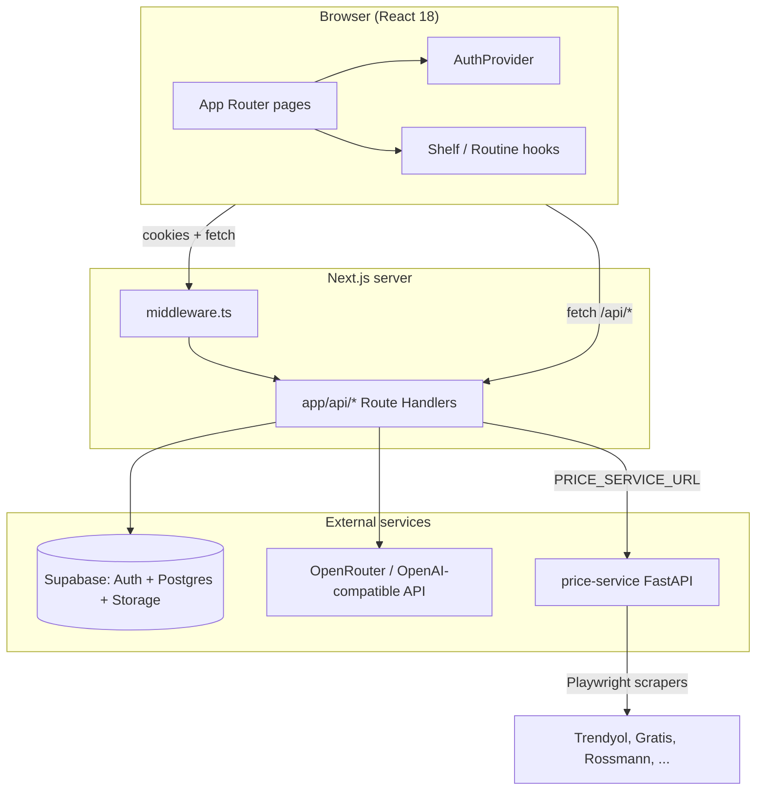
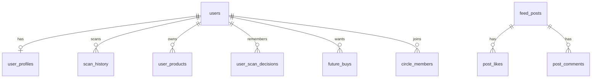

# Pickly — Technical Documentation

**Pickly** is a personalized beauty and personal-care web app. Users scan products with their camera, receive AI-powered suitability scores tailored to their profile (skin, hair, allergies, goals), compare prices across Turkish retailers, manage a digital **shelf** and **routine**, track spending in a **wallet**, and participate in a lightweight **community** (circles and feed).

This document is the single source of truth for how the codebase is organized, how data flows, and how each major piece fits together.

---

## Table of contents

1. [High-level architecture](#high-level-architecture)
2. [Tech stack](#tech-stack)
3. [Repository layout](#repository-layout)
4. [Getting started](#getting-started)
5. [Environment variables](#environment-variables)
6. [Core user journeys](#core-user-journeys)
7. [Pages and routing](#pages-and-routing)
8. [API routes](#api-routes)
9. [Authentication and session](#authentication-and-session)
10. [Database and migrations](#database-and-migrations)
11. [AI product analysis pipeline](#ai-product-analysis-pipeline)
12. [Price comparison service](#price-comparison-service)
13. [Client state, hooks, and context](#client-state-hooks-and-context)
14. [Domain libraries (`lib/`)](#domain-libraries-lib)
15. [UI components](#ui-components)
16. [Internationalization (i18n)](#internationalization-i18n)
17. [Design system and styling](#design-system-and-styling)
18. [Testing](#testing)
19. [Build, deploy, and operations](#build-deploy-and-operations)
20. [Troubleshooting](#troubleshooting)
21. [Glossary](#glossary)

---

## High-level architecture

Pickly is a **Next.js 14 App Router** frontend with **Route Handlers** (serverless API routes) and a separate **Python FastAPI** microservice for retailer price scraping.



| Layer | Responsibility |
|--------|----------------|
| **Pages (`app/`)** | UI, camera capture, onboarding, shelf/wallet/community screens |
| **API (`app/api/`)** | Auth-gated orchestration: analyze, price search, profile, social |
| **`lib/pickly-analyze/`** | Vision prompts, Zod schemas, JSON repair, allergen safety, response trimming |
| **`price-service/`** | Parallel scrapers + fuzzy matching → ranked TRY listings |
| **Supabase** | Users, profiles, scan history, shelf products, social tables, RLS |

---

## Tech stack

| Area | Choice |
|------|--------|
| Framework | [Next.js 14.2](https://nextjs.org/) (App Router) |
| Language | TypeScript 5 |
| UI | React 18, Tailwind CSS 3, [shadcn/ui](https://ui.shadcn.com/) (Radix primitives) |
| Animation | Framer Motion |
| Forms | react-hook-form + Zod |
| Auth & DB | [Supabase](https://supabase.com/) (`@supabase/ssr`, `@supabase/supabase-js`) |
| AI | OpenAI SDK pointed at [OpenRouter](https://openrouter.ai/) (vision + chat) |
| i18n | i18next + react-i18next (`en`, `tr`) |
| Price scraping | Python 3.12, FastAPI, Playwright, Scrapling |
| E2E tests | Playwright |

---

## Repository layout

```
Picklywebapp11-main/
├── app/                    # Next.js App Router: pages + API routes
├── components/             # React components (feature + ui/)
├── contexts/               # React context (auth)
├── hooks/                  # Custom hooks (shelf, routine, profile header)
├── lib/                    # Business logic, Supabase clients, AI pipeline
│   └── pickly-analyze/     # Analyze orchestration (prompts, schema, safety)
├── services/               # Thin client wrappers (e.g. analyzeProduct)
├── types/                  # Shared TypeScript types (User, ProductRating, …)
├── scripts/                # SQL migrations (run in Supabase SQL editor)
├── price-service/          # Standalone FastAPI price scraper
├── public/                 # Static assets (logos, images)
├── tests/                  # Playwright E2E (auth)
├── middleware.ts           # Supabase session refresh on every matched request
├── next.config.mjs
├── package.json
└── .env.example
```

---

## Getting started

### Prerequisites

- **Node.js** 18+ and **pnpm** (or npm/yarn)
- **Supabase** project (URL + anon key; optional service role for admin scripts)
- **OpenRouter** or **OpenAI** API key for product analysis and chat
- **Python 3.12** + Playwright browsers (only if running price service locally)

### 1. Install and configure the web app

```bash
cd Picklywebapp11-main
pnpm install
cp .env.example .env.local
# Fill NEXT_PUBLIC_SUPABASE_URL, NEXT_PUBLIC_SUPABASE_ANON_KEY, OPENROUTER_API_KEY (or OPENAI_API_KEY)
pnpm dev
```

App runs at **http://localhost:3000**.

### 2. Apply database migrations

Run SQL files in **`scripts/`** in numeric order inside the Supabase SQL editor (or via CLI). See [Database and migrations](#database-and-migrations).

### 3. (Optional) Run the price service

```bash
cd price-service
python -m venv .venv
# Windows: .venv\Scripts\activate
pip install -r requirements.txt
playwright install chromium
cp .env.example .env
uvicorn main:app --host 0.0.0.0 --port 8001
```

Set in `.env.local`:

```env
PRICE_SERVICE_URL=http://localhost:8001
```

> **Note:** `.env.example` documents port `8001` for the Next app; `price-service/.env.example` defaults to `8000`. Use one port consistently.

### Scripts (`package.json`)

| Script | Purpose |
|--------|---------|
| `pnpm dev` | Next.js development server |
| `pnpm build` | Production build |
| `pnpm start` | Serve production build |
| `pnpm lint` | ESLint |
| `pnpm test` | Playwright E2E |
| `pnpm clean` | Remove `.next` (helps Windows stale chunk issues) |

---

## Environment variables

### Web app (`.env.local`)

| Variable | Required | Description |
|----------|----------|-------------|
| `NEXT_PUBLIC_SUPABASE_URL` | Yes | Supabase project URL |
| `NEXT_PUBLIC_SUPABASE_ANON_KEY` | Yes | Public anon key (RLS-protected) |
| `OPENROUTER_API_KEY` or `OPENAI_API_KEY` | Yes* | Vision analyze + chat (*required for scan/assistant) |
| `PRICE_SERVICE_URL` | For prices | Base URL of Python service (e.g. `http://localhost:8001`) |
| `SUPABASE_SERVICE_ROLE_KEY` | Optional | Server admin client (`lib/supabase.ts` `createServerSupabaseClient`) |
| `NEXT_PUBLIC_SITE_URL` | Optional | Referer header for OpenRouter |
| `PICKLY_OPENROUTER_MODEL` | Optional | Override model (default: `openai/gpt-4.1-mini`) |

### Price service (`price-service/.env`)

| Variable | Default | Description |
|----------|---------|-------------|
| `PORT` | `8000` | Uvicorn bind port |

---

## Core user journeys

### 1. Sign up → onboarding → home

1. Landing (`/`) or splash (`/splash`) → **Auth** (`/auth`, `/signup`).
2. Supabase Auth creates session; `AuthProvider` loads `users` + `user_profiles` via `DatabaseService`.
3. If `onboarding_complete` is false: **terms** (localStorage via `onboarding-terms-storage`) → **categories, priorities, shopping style** → **complete**.
4. Redirect to **`/home`** with bottom nav visible.

### 2. Scan a product (primary loop)

1. User opens **`/camera`** (center nav button).
2. Camera or file upload → base64 image.
3. `ScanLimitService` enforces daily scan quota (`users_scan_limits` table).
4. `POST /api/analyze-product` with `mode: "in_store" | "research"`, optional `client_context` (shelf, routine, future buys).
5. Server builds prompt blocks from profile + DB history → **vision model** → Zod validation → allergen override → optional trim for in-store UI.
6. Result saved to `scan_history`; UI uses `scan-result-view-model` + `PriceSearch` component.
7. User can add to shelf, routine, future buys, or dismiss (tracked in `user_scan_decisions`).

### 3. Shelf, routine, wallet

- **Shelf** (`user_products`): SSOT for owned products, prices, categories, PAO/expiry.
- **Routine** (client state + shelf linkage): AM/PM steps referencing shelf product IDs.
- **Wallet** (`/wallet`): **Derived** from shelf via `wallet-derivation.ts` (monthly spend, category breakdown, clean score)—not a separate transactions table.

### 4. Compare two products

- **`/compare`**: Pick scan history item and/or shelf item; `compare-logic.ts` only declares a score winner when **both** sides are scans with valid Pickly scores.

### 5. Community

- **`/community`**: Circles catalog, join/leave, feed posts (API under `app/api/social/`).

### 6. Assistant chat

- **`/assistant`** or embedded cards: `POST /api/chat` (Edge runtime, streaming) with optional `productData` for product-specific Q&A.

---

## Pages and routing

All routes live under `app/`. Layout: `app/layout.tsx` wraps the app with `ThemeProvider`, `AuthProvider`, `I18nProvider`, `BottomNavigation`, and `Toaster`.

### Public / marketing

| Route | File | Purpose |
|-------|------|---------|
| `/` | `app/page.tsx` | Marketing landing |
| `/splash` | `app/splash/page.tsx` | Branded entry → auth |
| `/legal/terms` | `app/legal/terms/page.tsx` | Terms of service |
| `/legal/privacy` | `app/legal/privacy/page.tsx` | Privacy policy |

### Auth

| Route | File | Purpose |
|-------|------|---------|
| `/auth` | `app/auth/page.tsx` | Sign in |
| `/signup` | `app/signup/page.tsx` | Registration |
| `/auth/callback` | `app/auth/callback/page.tsx` | OAuth redirect handler |
| `/auth/forgot-password` | `app/auth/forgot-password/page.tsx` | Password reset |

### Onboarding (sequential)

| Route | Purpose |
|-------|---------|
| `/onboarding/terms` | Accept terms (also mirrored in localStorage) |
| `/onboarding/age` | Product categories (legacy route name) |
| `/onboarding/gender` | Purchase priorities (legacy route name) |
| `/onboarding/height` | Shopping style (legacy route name) |
| `/onboarding/weight` | Redirects to complete (legacy route) |
| `/onboarding/complete` | Finalize → sets `onboarding_complete` |

Shared UI: `onboarding-shell.tsx`, `onboarding-progress.tsx`, `app/onboarding/layout.tsx`.

### Main app (protected via `ProtectedRoute` + auth)

| Route | Purpose |
|-------|---------|
| `/home` | Dashboard: greeting, shelf preview, routine builder, assistant card, notifications |
| `/camera` | **Scanner**: capture, analyze, results, price search, shelf/routine actions |
| `/history` | Past scans |
| `/profile` | User profile, badges, share card |
| `/settings` | App settings, locale |
| `/products` | Shelf management |
| `/wallet` | Spend analytics from shelf |
| `/compare` | Side-by-side compare |
| `/community` | Circles + social feed |
| `/assistant` | Standalone Pickly chat |
| `/premium` | Premium upsell (placeholder/marketing) |
| `/scan` | Legacy/alternate scan entry (if linked from older flows) |

### Bottom navigation

Defined in `components/bottom-navigation.tsx`. Shown only when user is logged in and **not** on auth, onboarding, or legal routes.

| Tab | Path |
|-----|------|
| Home | `/home` |
| Circles | `/community` |
| Scan (center FAB) | `/camera` |
| History | `/history` |
| Profile | `/profile` |

Brand colors: primary olive `#697254`, background cream `#F5EFE6` / `#EFE5D8`.

---

## API routes

All handlers under `app/api/`. Unless noted, routes expect a **Supabase session cookie** (set by middleware).

### Product intelligence

| Method | Path | Description |
|--------|------|-------------|
| `POST` | `/api/analyze-product` | Vision analysis; persists `scan_history`; returns `PicklyApiEnvelope` |
| `GET` | `/api/analyze-product` | Health/metadata (prompt version, model id) |
| `POST` | `/api/price-search` | Proxies to Python service; rate limit 10/hour/user; enriches retailer logos |
| `POST` | `/api/chat` | Streaming assistant (Edge); general or product-scoped |

### User

| Method | Path | Description |
|--------|------|-------------|
| `GET` / `PUT` | `/api/user/profile` | Read/update `user_profiles` |
| `GET` / `PATCH` | `/api/user/profile-header` | Display name + avatar for headers |
| `POST` / `DELETE` | `/api/user/profile-avatar` | Upload/remove avatar (Supabase Storage) |
| `GET` / `DELETE` | `/api/user/scan-history` | List or delete scans |
| `POST` | `/api/user/scan-decisions` | Record dismiss / shelf / routine events |

### Lists & social

| Method | Path | Description |
|--------|------|-------------|
| `GET` / `POST` / `DELETE` | `/api/future-buys` | Wishlist-style future purchases |
| `GET` | `/api/badges` | User achievement badges |
| `GET` / `POST` / `DELETE` | `/api/follows` | User follow graph |
| `GET` | `/api/social/circles` | List circles |
| `POST` / `DELETE` | `/api/social/circles/[id]/join` | Join or leave circle |
| `GET` / `POST` | `/api/social/feed` | Community feed |

---

## Authentication and session

### Flow

1. **`middleware.ts`** runs on almost all paths (excludes static assets).
2. Delegates to `lib/supabase/middleware.ts` → `updateSession()` refreshes Supabase auth cookies.
3. **`contexts/auth-context.tsx`** (client):
   - Subscribes to `supabase.auth.onAuthStateChange`
   - Hydrates user from `localStorage` key `pickly-cached-user` for fast first paint
   - Loads `DatabaseService.getUser` + profile + maps scan history via `product-rating-from-scan-history`
   - Redirects: unsigned → `/auth`; incomplete onboarding → `/onboarding/*`; signed-in on auth pages → `/home`

### Supabase clients

| File | Use |
|------|-----|
| `lib/supabase/client.ts` | Browser client (`createBrowserClient`) |
| `lib/supabase/server.ts` | Server Components / Route Handlers (`createServerClient` + cookies) |
| `lib/supabase.ts` | Legacy singleton + optional service-role client |

### Route protection

`components/protected-route.tsx`: redirects unauthenticated users to `/auth`; optional `requireOnboarding` gate.

---

## Database and migrations

Migrations are **manual SQL files** in `scripts/`. Run in order after verifying table names match your Supabase project.

| File | What it adds |
|------|----------------|
| `001_create_products_table.sql` | `user_products` (shelf) + RLS |
| `002_add_new_profile_fields.sql` | Extra profile columns |
| `003_pickly_ship_backend.sql` | `analysis_json`, scan modes, `user_scan_decisions` |
| `004_user_products_shelf_ssot.sql` | `purchase_price`, `purchase_date`, routine fields on shelf |
| `005_social.sql` | Circles, feed, likes, comments, reviews |
| `006_user_follows.sql` | Follow relationships |
| `007_badges.sql` | Badge definitions and user badges |
| `008_shelf_flags.sql` | Shelf feature flags |
| `009_future_buys.sql` | Future purchase list |
| `010_user_display_name.sql` | Display name on profiles |
| `011_user_bio.sql` | Bio text |
| `012_profile_avatar_storage.sql` | Storage bucket policies for avatars |
| `013_drop_profile_age_gender.sql` | Drops unused `age` / `gender` from `user_profiles` |
| `014_drop_profile_height_weight.sql` | Drops unused `height` / `weight` from `user_profiles` |

### Conceptual data model



**Important design choices:**

- **Shelf is SSOT for price data** used by wallet (`004` comment).
- **Scan history** stores both legacy flat fields (`rating`, `explanation`) and rich `analysis_json` (Pickly envelope `result`).
- **RLS** on `user_products`: users only see their own rows.

TypeScript DB shapes: `lib/database.types.ts` (generate/update from Supabase when schema changes).

---

## AI product analysis pipeline

Entry: **`app/api/analyze-product/route.ts`**  
Logic: **`lib/pickly-analyze/*`**

### Request (`AnalyzeProductRequestSchema`)

- `imageBase64` (required)
- `mode`: `"in_store"` | `"research"`
- `locale`: `"en"` | `"tr"` (optional; falls back to profile)
- `product_type_hint`: skincare / haircare / fragrance / makeup
- `client_context`: compact shelf, routine strings, future buys

### Context assembly

| Block | Source |
|-------|--------|
| Profile | `user_profiles` row |
| Shelf | Client compact + caps (`CONTEXT_CAPS`) |
| Routine | Client AM/PM strings |
| Recent scans | `scan_history` (latest N) |
| Past decisions | `user_scan_decisions` |
| Future buys | Client list |

Formatted by `context-blocks.ts`; prompts in `prompts.ts`; version constant `PICKLY_PROMPT_VERSION` in `constants.ts`.

### Model execution

1. `runVisionAnalyze()` — multimodal call via `openrouter-client.ts`
2. `parseBodyFromContent()` — extract JSON from model output
3. On failure → `runRepairJson()` → still failing → `fallbackAnalyzeBody()`
4. `findTriggeredAllergens()` + `applyAllergenOverrideBody()` — hard safety layer
5. Escalate to full **research** depth when allergies, low score, dangerous verdict, or shelf match
6. `trimToPicklyNow()` — shorter UI payload for in-store mode

### Response (`PicklyApiEnvelope`)

- `request_id`, `prompt_version`, `model_id`, `validation_result` (`ok` | `repaired` | `fallback`)
- `context_stats` — how much context was sent
- `result` — `PicklyAnalyzeResult` (score 0–10, verdict, ingredients, shelf_match, routine_fit, quick_prompts, …)

Client mapping: `map-envelope-to-product-rating.ts` → `ProductRating` type in `types/index.ts`.  
UI view model: `scan-result-view-model.ts`.

---

## Price comparison service

**Location:** `price-service/`  
**Stack:** FastAPI, Playwright (shared browser in `fetch.py`), per-retailer modules in `scrapers/`.

### Retailers

| Key | Module |
|-----|--------|
| akakce | `scrapers/akakce.py` |
| trendyol | `scrapers/trendyol.py` |
| gratis | `scrapers/gratis.py` |
| rossmann | `scrapers/rossmann.py` |
| watsons | `scrapers/watsons.py` |
| eve | `scrapers/eve.py` |
| sephora | `scrapers/sephora.py` |

### Endpoints

| Method | Path | Description |
|--------|------|-------------|
| `GET` | `/health` | Liveness |
| `GET` | `/ready` | Readiness (browser initialized) |
| `POST` | `/price-search` | Body: `brand`, `product_name` → `MatchedListing[]` |

`matcher.py` ranks raw candidates; tests in `price-service/tests/test_matching.py` + `golden_set.json`.

Next.js **`/api/price-search`** authenticates the user, optionally loads product fields from `scan_id`, calls `PRICE_SERVICE_URL`, maps retailer keys to logos in `public/logos/`.

---

## Client state, hooks, and context

### Context

| Module | Role |
|--------|------|
| `contexts/auth-context.tsx` | User session, sign in/out, profile updates, scan history CRUD |

### Hooks

| Hook | Role |
|------|------|
| `use-shared-shelf.ts` | Load/sync shelf products from Supabase |
| `use-shared-routine.ts` | AM/PM routine steps tied to shelf |
| `use-profile-header.ts` | Display name + avatar for nav/home |
| `use-display-name.ts` | Display name resolution helpers |
| `use-toast.ts` | Toast notifications (shadcn) |
| `use-mobile.tsx` | Responsive breakpoint helper |

### Services

| Module | Role |
|--------|------|
| `services/ai-service.ts` | Client `analyzeProduct()` → `POST /api/analyze-product` |

---

## Domain libraries (`lib/`)

| Module | Purpose |
|--------|---------|
| `database-service.ts` | CRUD for users, profiles, scans, shelf products |
| `user-product-mapper.ts` | DB row ↔ `SharedShelfProduct` |
| `scan-limit-service.ts` | Daily scan quotas |
| `wallet-derivation.ts` | Aggregates shelf → wallet UI metrics |
| `compare-logic.ts` | Compare page verdict logic |
| `scan-result-view-model.ts` | Camera result UI state machine |
| `shelf-types.ts` / `shelf-presentation.ts` / `shelf-utils.ts` | Shelf categories, labels, dates |
| `display-name-resolve.ts` / `display-name-storage.ts` | Username display rules |
| `profile-avatar.ts` / `profile-bio.ts` | Profile media helpers |
| `onboarding-terms-storage.ts` | localStorage terms acceptance per user id |
| `legal-static-copy.ts` | Legal page content |
| `pickly-circles-data.ts` | Static/mock circle seed data |
| `pickly-mock-data.ts` | Shared types, routine meta, mock helpers |
| `product-rating-from-scan-history.ts` | Rehydrate `ProductRating` from DB rows |
| `openrouter-client.ts` | OpenAI-compatible client for OpenRouter |
| `utils.ts` | `cn()`, logger, `retryWithBackoff` |
| `icons.tsx` | Centralized Iconoir exports |
| `i18n/` | i18next setup + `en.json` / `tr.json` |

### `lib/pickly-analyze/` (server-side AI)

| File | Purpose |
|------|---------|
| `schema.ts` | Zod schemas for request/response |
| `prompts.ts` | System/user prompt templates |
| `context-blocks.ts` | Format DB/client context for prompts |
| `run-model.ts` | Vision call + JSON repair |
| `json-parse.ts` | Robust JSON extraction |
| `safety.ts` | Allergen detection and overrides |
| `trim-result.ts` | In-store response slimming |
| `shelf-escalation.ts` | When to prefetch research depth |
| `fingerprint.ts` | Product fingerprint for decisions |
| `fallback-body.ts` | Safe default analyze body |
| `constants.ts` | Model id, caps, prompt version |

---

## UI components

### Feature components (`components/`)

| Component | Purpose |
|-----------|---------|
| `bottom-navigation.tsx` | Main app tab bar |
| `protected-route.tsx` | Auth gate |
| `PriceSearch.tsx` | Price listings after scan |
| `pickly-assistant-card.tsx` | Home assistant entry |
| `routine-builder-card.tsx` | AM/PM routine editor |
| `notifications-sheet.tsx` | Notification drawer |
| `profile-avatar.tsx` / `profile-share-card.tsx` | Profile UX |
| `scan-mode-picker.tsx` | In-store vs research mode |
| `legal-page-shell.tsx` | Legal pages layout |
| `theme-provider.tsx` | next-themes wrapper |
| `i18n-provider.tsx` | react-i18next provider |
| `animated-logo.tsx` / `page-transition.tsx` | Motion polish |

### `components/ui/`

shadcn/ui primitives: `button`, `card`, `dialog`, `sheet`, `select`, `toast`, etc. Built on Radix UI + Tailwind.

---

## Internationalization (i18n)

- Config: `lib/i18n/index.ts`, locales: `lib/i18n/locales/en.json`, `tr.json`
- Locale persistence: `lib/i18n/locale.ts` (localStorage + `document.documentElement.lang`)
- Usage: `useTranslation()` in pages; `getAppLocale()` for API payloads
- Analyze + chat respect `locale` / profile `locale` for Turkish vs English copy

---

## Design system and styling

- Global styles: `app/globals.css`, `styles/globals.css`
- Tailwind config: `tailwind.config.ts`
- Fonts: Fontshare preconnect in root layout
- Primary palette: olive green `#697254`, warm neutrals `#EFE5D8`, `#F5EFE6`
- `next.config.mjs`: `images.unoptimized: true`; dev webpack cache disabled on Windows

---

## Testing

| Location | Type | What it covers |
|----------|------|----------------|
| `tests/auth.spec.ts` | Playwright E2E | Sign-in flow |
| `price-service/tests/test_matching.py` | pytest | Listing matcher against golden set |

Run: `pnpm test` (from app root; requires dev server or `webServer` config in Playwright).

---

## Build, deploy, and operations

### Next.js

```bash
pnpm build
pnpm start
```

Build currently sets `eslint.ignoreDuringBuilds` and `typescript.ignoreBuildErrors` in `next.config.mjs`—treat as technical debt if tightening CI.

### Price service

- `price-service/Dockerfile` for container deployment
- Ensure Playwright browsers available in the image
- Expose `/health` and `/ready` for orchestration

### Supabase

- Enable Google OAuth in dashboard if using `signInWithGoogle`
- Run all `scripts/*.sql` on production in order
- Configure Storage bucket from `012_profile_avatar_storage.sql`

### Security notes

- Never commit `.env.local` or service role keys
- RLS must stay enabled on user-owned tables
- Rate limits: price search (in-memory per instance), scan limits (DB-backed)
- Allergen overrides are server-side—do not rely on model-only safety

---

## Troubleshooting

| Symptom | Likely cause | Fix |
|---------|--------------|-----|
| `Unauthorized` on API | Missing/expired session | Sign in again; check middleware + cookies |
| `503` on analyze | No API key | Set `OPENROUTER_API_KEY` or `OPENAI_API_KEY` |
| Price search always empty | Price service down or wrong URL | Start `uvicorn`, set `PRICE_SERVICE_URL` |
| Windows dev chunk errors | Stale `.next` cache | `pnpm clean` then `pnpm dev` |
| Playwright fails on Windows | Event loop policy | `main.py` sets `WindowsProactorEventLoopPolicy` |
| Extended scan insert warning | DB missing `analysis_json` columns | Run `003_pickly_ship_backend.sql` |

---

## Glossary

| Term | Meaning |
|------|---------|
| **Pickly score** | 0–10 suitability score from vision analysis |
| **Verdict** | `Excellent match`, `Good, watch out`, `Not recommended`, `Dangerous` |
| **Shelf** | User-owned product inventory (`user_products`) |
| **Routine** | Ordered AM/PM steps referencing shelf products |
| **In-store mode** | Faster, trimmed analyze response for shopping |
| **Research mode** | Deeper analysis (ingredients, conflicts, shelf match) |
| **Envelope** | Full API response wrapper around `result` + metadata |
| **SSOT** | Single source of truth (shelf owns prices for wallet) |
| **RLS** | Supabase row-level security |

---

## Quick reference: where to change what

| You want to… | Edit |
|--------------|------|
| Change scan UI / camera flow | `app/camera/page.tsx`, `lib/scan-result-view-model.ts` |
| Change AI prompts or output shape | `lib/pickly-analyze/prompts.ts`, `schema.ts` |
| Add a retailer | `price-service/scrapers/`, register in `main.py` `SCRAPERS` |
| Add DB table/column | New `scripts/0xx_*.sql`, update `database.types.ts` |
| Add API endpoint | `app/api/<name>/route.ts` |
| Add translated string | `lib/i18n/locales/en.json` + `tr.json` |
| Change nav tabs | `components/bottom-navigation.tsx` |
| Change auth redirects | `contexts/auth-context.tsx` |

---

*Last updated to reflect the codebase structure as of the Pickly web app monorepo layout (`Picklywebapp11-main/`). For product questions or roadmap, refer to your team’s product docs; this README is strictly technical.*
